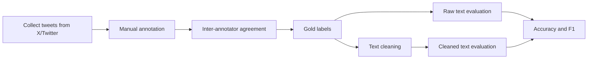

# Tweet Annotation and Zero-Shot Evaluation for Harmful Content Detection


A compact NLP evaluation project that builds a manually annotated tweet dataset, measures inter-annotator agreement, applies text normalization, and evaluates a pretrained Twitter RoBERTa model in a zero-shot-style harmful-content screening setup.

The project is intentionally small, but it demonstrates the full applied NLP workflow: annotation design, reliability measurement, preprocessing, model inference, metric reporting, and reproducibility notes.

## Why This Project Matters

Moderation models are often judged only by final accuracy. This repo shows the work that happens before that number is meaningful:

- Clear annotation rules for `Hate/Offensive` vs. `Neutral` tweets.
- Two independent annotators and a measured agreement score.
- A balanced 200-row evaluation set collected from X/Twitter search and hashtag queries.
- Before/after cleaning comparison to test whether basic normalization changes model behavior.
- Transparent limitations around zero-shot label mapping and sample size.

## Repository Structure

| File | Purpose |
| --- | --- |
| `1_Data_cleaning_and_basic_analysis.ipynb` | Loads annotated tweets, checks label balance, computes Cohen's kappa, cleans text, and exports the cleaned dataset. |
| `2_training_and_evaluation.ipynb` | Runs pretrained transformer inference on raw and cleaned text, maps model outputs to binary labels, and reports accuracy/F1. |
| `annotation_guidelines.pdf` | Human annotation rubric defining `Hate/Offensive` and `Neutral` examples/decision criteria. |
| `Data_Annotation_documentation_final.pdf` | Project write-up covering motivation, methodology, challenges, and results. |
| `final_tweets.xlsx` | Original 200-row annotated tweet dataset. |
| `final_tweets_cleaned .xlsx` | Cleaned text dataset produced after normalization. |
| `final_uncleaned_predicted__data.xlsx` | Exported predictions for the raw-text evaluation run. |
| `final_cleaned_predicted__data.xlsx` | Exported cleaned-run prediction artifact. See reproducibility note below. |

## Dataset

The dataset contains 200 English tweets collected from X/Twitter using topic and hashtag searches such as:

- `#USElection2024`
- `#cancerfree`
- `#positivity`
- `#peace`
- `#cr7`
- `#funny`
- `#appreciation`
- `#racist`

Each tweet is labeled by two annotators:

| Label | Meaning | Count in gold labels |
| --- | --- | ---: |
| `0` | Neutral | 101 |
| `1` | Hate/Offensive | 99 |

The near-balanced label distribution makes the evaluation easier to interpret because accuracy is less dominated by a majority class.

## Annotation Quality

The project uses Cohen's kappa to measure agreement between the two annotators.

| Metric | Value |
| --- | ---: |
| Annotator-1 neutral/offensive split | 102 / 98 |
| Annotator-2 neutral/offensive split | 101 / 99 |
| Gold-label neutral/offensive split | 101 / 99 |
| Cohen's kappa | `0.910` |

A kappa score around `0.91` indicates strong agreement and supports the reliability of the manually labeled evaluation set.

## Model and Label Mapping

The notebook uses [`cardiffnlp/twitter-roberta-base-sentiment`](https://huggingface.co/cardiffnlp/twitter-roberta-base-sentiment), a RoBERTa-base model trained on roughly 58M tweets and fine-tuned on TweetEval sentiment classification. Its native labels are:

| Model label | Native meaning |
| --- | --- |
| `LABEL_0` | Negative |
| `LABEL_1` | Neutral |
| `LABEL_2` | Positive |

For this project, the model is used as a zero-shot proxy for harmful-content screening:

- `LABEL_0` maps to `Hate/Offensive`.
- `LABEL_1` and `LABEL_2` map to `Neutral`.

This is not the same as training a hate-speech classifier. The value of the project is in testing how far a general Twitter sentiment model can go under a clearly documented label-mapping assumption.

## Pipeline



## Text Cleaning

The cleaning notebook applies lightweight normalization:

- Remove repeated `LINK` placeholders.
- Lowercase text.
- Remove punctuation and special characters.
- Preserve hashtags because hashtag text can carry semantic signal.
- Export cleaned rows to Excel for downstream inference.

The cleaning is intentionally conservative. For social media NLP, over-cleaning can remove signals such as hashtags, slang, emphasis, or identity terms.

## Results

### Notebook-Reported Metrics

| Evaluation run | Accuracy | F1 score |
| --- | ---: | ---: |
| Raw tweets | `0.920` | `0.919` |
| Cleaned tweets | `0.925` | `0.924` |

The notebook reports a small lift after text cleaning, suggesting that basic normalization helped the model slightly on this sample.

### Exported Artifact Verification

Recomputing metrics from the saved prediction Excel files gives:

| Exported file | Accuracy | Precision | Recall | F1 | Confusion matrix `[[TN, FP], [FN, TP]]` |
| --- | ---: | ---: | ---: | ---: | --- |
| `final_uncleaned_predicted__data.xlsx` | `0.920` | `0.919` | `0.919` | `0.919` | `[[93, 8], [8, 91]]` |
| `final_cleaned_predicted__data.xlsx` | `0.920` | `0.919` | `0.919` | `0.919` | `[[93, 8], [8, 91]]` |

## Reproducibility Note

In `2_training_and_evaluation.ipynb`, the cleaned evaluation is performed on the cleaned dataframe, but the final export cell writes `df` instead of `data`:

```python
df.to_excel("final_cleaned_predicted__data.xlsx", index=False)
```

Because of that, the saved cleaned prediction artifact may not fully represent the cleaned in-memory run shown in the notebook output. The notebook-reported cleaned metrics remain visible in the executed notebook, while the exported Excel metrics above reflect what is currently saved in the repository.

A production-grade follow-up would change that cell to:

```python
data.to_excel("final_cleaned_predicted__data.xlsx", index=False)
```

## How to Run

### 1. Create an environment

```bash
python -m venv .venv
.venv\Scripts\activate
pip install pandas openpyxl scikit-learn matplotlib transformers torch
```

On macOS/Linux:

```bash
python -m venv .venv
source .venv/bin/activate
pip install pandas openpyxl scikit-learn matplotlib transformers torch
```

### 2. Run the notebooks

Run in this order:

1. `1_Data_cleaning_and_basic_analysis.ipynb`
2. `2_training_and_evaluation.ipynb`

The first notebook prepares the cleaned dataset. The second notebook runs transformer inference and metric evaluation.

## Key Technical Skills Demonstrated

- Dataset construction and manual annotation.
- Annotation guideline design.
- Inter-annotator reliability measurement with Cohen's kappa.
- Social-media text cleaning and normalization.
- Hugging Face `transformers` inference pipeline.
- Binary classification metric reporting.
- Error-aware interpretation of model outputs.
- Clear separation between human labels, gold labels, and model predictions.

## Limitations

- The dataset has 200 examples, so results should be treated as a controlled sample evaluation, not a broad benchmark.
- Tweets were collected manually from selected hashtags/search terms, so the sample may not represent all X/Twitter content.
- The model is a sentiment classifier, not a dedicated hate-speech detector.
- The binary mapping from negative sentiment to hate/offensive content is useful for experimentation but can confuse harsh sentiment with actual abuse.
- The cleaned export artifact should be regenerated after fixing the final save-cell issue described above.

## Future Work

- Replace the sentiment proxy with a dedicated hate/offensive speech model and compare performance.
- Add macro-F1, ROC-AUC, precision/recall by class, and calibration plots.
- Expand the dataset with more topics, more annotators, and adjudication for disagreements.
- Add a script-based pipeline so results can be reproduced without manual notebook execution.
- Track false positives and false negatives with qualitative error categories.

## References

- [CardiffNLP Twitter RoBERTa sentiment model](https://huggingface.co/cardiffnlp/twitter-roberta-base-sentiment)
- [TweetEval: Unified Benchmark and Comparative Evaluation for Tweet Classification](https://aclanthology.org/2020.findings-emnlp.148/)
- [Hugging Face Transformers](https://huggingface.co/docs/transformers/index)
- [scikit-learn classification metrics](https://scikit-learn.org/stable/modules/model_evaluation.html#classification-metrics)

## License

This project is released under the MIT License. See [`LICENSE`](LICENSE).
